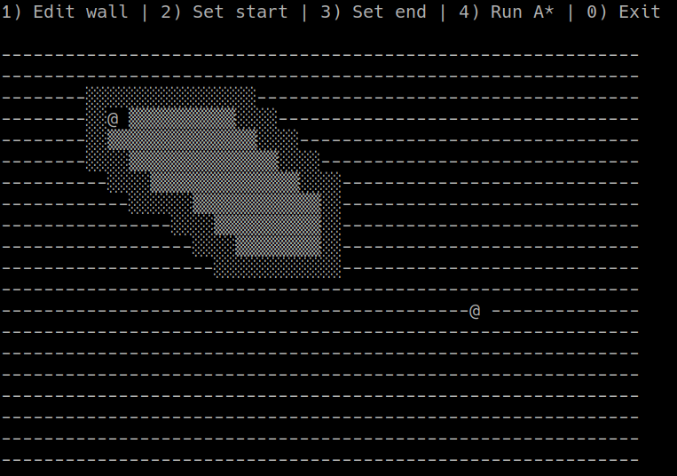

# Shortest Path Finder

Shortest Path Finder is a tool that demonstrates the [A* search algorithm](https://en.wikipedia.org/wiki/A*_search_algorithm).
The goal of this application is to showcase the power of this algorithm and demonstrate why it is widely used for pathfinding.

## Requirements
You must have [Python3](https://www.python.org/downloads/) installed to run this program.

## How to run
First, clone this repository onto your machine and enter the directory.
```shell script
git clone git@github.com:itscharlieliu/shortest-path-finder.git
cd shortest-path-finder
```

Then, install the requirements
```shell script
pip3 install -r requirements.txt
```

Finally, start the program
```shell script
python3 main.py
```

## Screenshots



